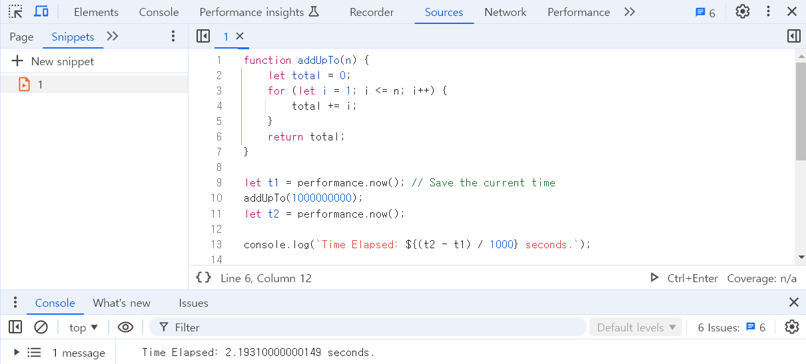
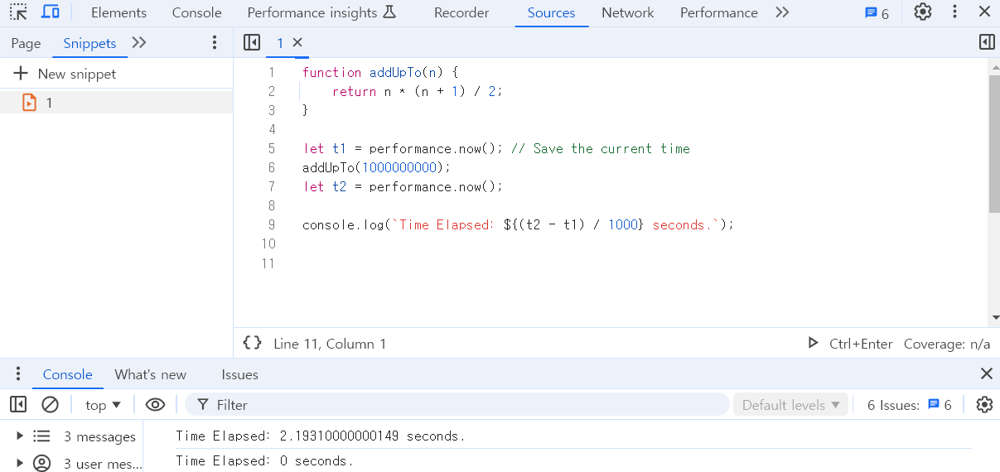

# Big O

목표
- Big O 표기법의 필요성을 설명한다.
- Big O 표기법이 무엇인지 설명한다.
- Big O 표현식을 간소화한다.
- "시간 복잡도"와 "공간 복잡도"를 정의한다.
- Big O 표기법을 사용하여 다양한 알고리즘의 시간 복잡도와 공간 복잡도를 평가한다.

---

## Big O 표기법의 필요성
- 어떤 문제에 해결법이 여러 개 있을 때, 그 해결법이 "좋은"것인지, "그저 그런" 것인지, "엉망인" 것인지 성능을 숫자로 평가할 수 있게 해준다.
- 코드 성능에 대해 정확한 용어를 사용하는 것이 중요하다.
- 서로 다른 접근 방식 간의 트레이드오프를 논의할 때 Big O 표기법을 사용하면 유용하다.
- 코드가 느려지거나 충돌할 때 비효율적인 부분을 식별하는 것은 애플리케이션의 문제점을 찾아 해결하는 데 도움이 된다.애플리케이션의 문제점을 찾아 해결하는 데 도움이 된다.

## 코드의 시간을 재는 법
`timing function`을 사용하여 코드의 실행 시간을 측정할 수 있다.

n까지의 합을 구해 리턴하는 함수 두 개의 실행시간을 비교해보자 

1. 첫 번째 코드
```javascript
function addUpTo(n){
    let total = 0;    
    for(let i = 1; i <= n ; i++) {
        total += i;
    }
    return total;    
}

let t1 = performance.now(); //브라우저가 열린 시간을 저장
addUpTo(1000000000);
let t2 = performance.now();

console.log(`Time Elapsed: ${(t2 - t1) / 1000} seconds.`);
```

실행해보면 2.193s 가 소요되는 걸 확인할 수 있다.

2. 두 번째 코드
```javascript
function addUpTo(n) {    
    return n * (n + 1) / 2;
}

let t1 = performance.now(); // Save the current time
addUpTo(1000000000);
let t2 = performance.now();

console.log(`Time Elapsed: ${(t2 - t1) / 1000} seconds.`);
```


측정된 값이 캡처하기에 너무 작아서 0으로 표시되는 걸 확인할 수 있다.

3. 비교 결과

똑같은 데이터를 다뤄 똑같은 출력을 하지만, 두 번째 코드가 훨씬 짧은 시간 안에 해냈음을 확인할 수 있다.

그러나 이렇게 수동으로 코드의 속도를 비교하는 건 불확실한 부분이 있어 좋지 않다.
1) 기기마다 다른 방식으로 시간을 기록한다.
    - 기기의 사양에 따라 실행 시간이 다를 수 있다.
    - 기기에 어떤 것이 실행되고 있는지에 따라서도 다를 수 있다.

2) 같은 기기에서도 실행할 때마다 다른 시간을 기록한다.
    - 정확하지 않다는 것을 나타낸다.
3) 빠른 알고리즘에서는 짧은 시간 안에 모든 것이 처리된다.
    - 속도 측정 정확도가 낮을 수 있기에 빠른 알고리즘이 여러 개 존재하면 그것들 사이의 작은 차이를 측정해내지 못할 수 있다.